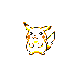
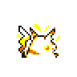
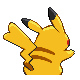
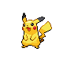
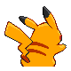
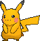

# PokéAPI Sprites <a href="https://pokeapi.co/api/v2/pokemon/smeargle"></a>

To save load on PokéAPI, we host all the sprite images here.
If you want to use all the sprites in your application, you can just download the entire contents directly.

## Install

### Git

```sh
git clone https://github.com/PokeAPI/sprites.git
```

### Npm

```sh
npm install --save github:PokeAPI/sprites
```

### Bower

```sh
bower install --save PokeAPI/sprites
```

## Sprites

The sprites are divided in the different subfolders you can see below. 

```
sprites
\- pokemon
    \- other
        \- dream world (SVGs)
        \- official artwork (PNGs)
    \- versions
        \- generation i
            \- red and blue (PNGs with back, gray, transparent, back-gray variants)
            \- yellow (PNGs with back, gbc, gray, transparent, back-gbc, back-gray, back-transparent variants)
        \- generation ii
            \- crystal (PNGs with back, shiny, back-shiny, transparent, transparent-shiny, back-transparent, back-transparent-shiny variants)
            \- gold (PNGs with back, shiny, transparent, back-shiny variants)
            \- silver (PNGs with back, shiny, transparent, back-shiny variants)
        \- generation iii
            \- emerald (PNGs with shiny variants)
            \- fire red and leaf green (PNGs with back, shiny, back-shiny variants)
            \- ruby and sapphire (PNGs with back, shiny, back-shiny variants)
        \- generation iv
            \- diamond and pearl (PNGs with back, female, shiny, back-female, back-shiny, shiny-female variants)
            \- heart gold and soul silver (PNGs with back, female, shiny, back-female, back-shiny, shiny-female variants)
            \- platinum (PNGs with back, female, shiny, back-female, back-shiny, shiny-female variants)
        \- generation v
            \- black and white (PNGs with back, female, shiny, back-female, back-shiny, shiny-female, animated variants)
        \- generation vi
            \- omega ruby and alpha sapphire (PNGs with female, shiny, shiny-female variants)
            \- x and y (PNGs with female, shiny, shiny-female variants)
        \- generation vii
            \- ultra sun and ultra moon (PNGs with female, shiny, shiny-female variants)
            \- icons (PNGs)
        \- generation viii
            \- icons (PNGs with female variants)
    \- default PokeAPI sprites (PNGs with back, female, shiny, back-female, back-shiny, shiny-female variants)
\- items
    \- default PokeAPI items (PNGs)
```

> All the following images are embedded at a maximum 100x100px size. All the smaller ones preserve their size while the bigger ones are embedded at 100x100px. 

### `pokemon`

#### `other`

##### `dream-world`

| Front |
| --- |
| SVG |
|  |

##### `home`

| Front |
| --- |
| PNG<br>_512x512_ |
|  |

##### `official-artwork`

| Front |
| --- |
| PNG<br>_475x475_ |
|  |

#### `versions`

##### `generation i`

###### `red-blue`

| Front | Back | Front gray | Front transparent | Back gray |
| --- | --- | --- | --- | --- |
| PNG<br>_40x40_, _48x48_, _56x56_ | PNG<br>_32x32_ | PNG<br>_40x40_, _48x48_, _56x56_ | PNG<br>_96x96_ | PNG<br>_32x32_ |
|  |  |  |  |  |

###### `yellow`

| Front | Back | Front gbc | Front gray | Front transparent | Back gray | Back gbc | Back transparent |
| --- | --- | --- | --- | --- | --- | --- | --- |
| PNG<br>_40x40_, _48x48_, _56x56_ | PNG<br>_32x32_ | PNG<br>_40x40_, _48x48_, _56x56_ | PNG<br>_40x40_, _48x48_, _56x56_ | PNG<br>_96x96_ | PNG<br>_32x32_ | PNG<br>_32x32_ | PNG<br>_96x96_ |
|  |  |  |  |  |  |  |  |


##### `generation ii`

###### `crystal`

| Front | Back | Front shiny | Back shiny | Front transparent | Back transparent | Front shiny transparent | Back shiny transparent |
| --- | --- | --- | --- | --- | --- | --- | --- |
| PNG<br>_40x40_, _48x48_, _56x56_ | PNG<br>_40x40_ | PNG<br>_40x40_, _48x48_, _56x56_ | PNG<br>_40x40_ | PNG<br>_96x96_ | PNG<br>_96x96_ | PNG<br>_96x96_ | PNG<br>_96x96_ |
|  |  |  |  |  |  |  |  |

###### `gold`

| Front | Back | Front shiny | Front transparent | Back shiny |
| --- | --- | --- | --- | --- |
| PNG<br>_40x40_, _48x48_, _56x56_ | PNG<br>_40x40_ | PNG<br>_40x40_, _48x48_, _56x56_ | PNG<br>_107x107, 80x80_ | PNG<br>_40x40_ |
|  |  |  |  |  |

###### `silver`

| Front | Back | Front shiny | Front transparent | Back shiny |
| --- | --- | --- | --- | --- |
| PNG<br>_40x40_, _48x48_, _56x56_ | PNG<br>_40x40_ | PNG<br>_40x40_, _48x48_, _56x56_ | PNG<br>_107x107, 80x80_ | PNG<br>_40x40_ |
|  |  |  |  |  |

##### `generation iii`

###### `emerald`

| Front | Front shiny |
| --- | --- |
| PNG<br>_64x64_ | PNG<br>_64x64_ |
|  |  |

###### `fire red and leaf green`

| Front | Back | Front shiny | Back shiny |
| --- | --- | --- | --- |
| PNG<br>_64x64_ | PNG<br>_64x64_ | PNG<br>_64x64_ | PNG<br>_64x64_ |
|  |  |  |  |

###### `ruby and sapphire`

| Front | Back | Front shiny | Back shiny |
| --- | --- | --- | --- |
| PNG<br>_64x64_ | PNG<br>_64x64_ | PNG<br>_64x64_ | PNG<br>_64x64_ |
|  |  |  |  |

##### `generation iv`

###### `diamond and pearl`

| Front | Back | Front female | Front shiny | Back female | Back shiny | Shiny female |
| --- | --- | --- | --- | --- | --- | --- |
| PNG<br>_80x80_ | PNG<br>_80x80_ | PNG<br>_80x80_ | PNG<br>_80x80_ | PNG<br>_80x80_ | PNG<br>_80x80_ | PNG<br>_80x80_ |
|  |  |  |  |  |  |  |

###### `heart gold and soul silver`

| Front | Back | Front female | Front shiny | Back female | Back shiny | Shiny female |
| --- | --- | --- | --- | --- | --- | --- |
| PNG<br>_80x80_ | PNG<br>_80x80_ | PNG<br>_80x80_ | PNG<br>_80x80_ | PNG<br>_80x80_ | PNG<br>_80x80_ | PNG<br>_80x80_ |
|  |  |  |  |  |  |  |

###### `platinum`

| Front | Back | Front female | Front shiny | Back female | Back shiny | Shiny female |
| --- | --- | --- | --- | --- | --- | --- |
| PNG<br>_80x80_ | PNG<br>_80x80_ | PNG<br>_80x80_ | PNG<br>_80x80_ | PNG<br>_80x80_ | PNG<br>_80x80_ | PNG<br>_80x80_ |
|  |  |  |  |  |  |  |

##### `generation v`

###### `black and white`

This folder contains the official B&W sprites on top of custom sprites designed by the [Smogon community](https://www.smogon.com/)

- The sprites with IDs greater than 650 are thus not official. You can find the source of these sprites at this [Smogon thread](https://www.smogon.com/forums/threads/sword-shield-sprite-project.3647722/) and also at this [Google Sheet](https://docs.google.com/spreadsheets/d/1acgzAjh0dnFRQnjZu8kSjS177rKCzpFfEHRLtwuuXRU/edit#gid=0). We thank leParagon, Blaquaza, TheAetherPlayer, G.E.Z., KingOfThe-X-Roads, Spook, Cynda, Involuntary Twitch, mjco, Z-nogyroP, PumpkinPastel, RadicalCharizard, HM100, N-Kin, Zerudez, MyMarshlands, Wobblebuns, princessofmusic, aXl, fishbowlsoul90, HealnDeal, Espeon Scientist, AMVictory, Mega-Pokebattlerz, Layell, GeoisEvil, Quanyails, RedRooster, Wyverii, Basic Vanillite, Larryturbo, TheCynicalPoet, Arkeis, paintseagull, Branflakes325, Siiilver, Noscium, Sleet, Zermonious, Bynine, Corson, Legitimate Username, TrainerSplash, Farriella, MrDollSteak, TeraVolt, Dleep, WPS, Brylark, KattenK, Travis, SpheX, SelenaArmorclaw and Hematite, who are the spriters that created these custom B&W sprites.

| Front | Back | Front female | Front shiny | Back female | Back shiny | Shiny female |
| --- | --- | --- | --- | --- | --- | --- |
| PNG<br>_96x96_ | PNG<br>_96x96_ | PNG<br>_96x96_ | PNG<br>_96x96_ | PNG<br>_96x96_ | PNG<br>_96x96_ | PNG<br>_96x96_ |
|  |  |  |  |  |  |  |

Animated

| Front  | Back | Front female | Front shiny | Back female | Back shiny | Shiny female |
| --- | --- | --- | --- | --- | --- | --- |
| GIF<br>_varies_ | GIF<br>_varies_ | GIF<br>_varies_ | GIF<br>_varies_ | GIF<br>_varies_ | GIF<br>_varies_ | GIF<br>_varies_ |
|  |  |  |  |  |  |  |


##### `generation vi`

###### `omega ruby and alpha sapphire`

| Front | Front female | Front shiny | Shiny female |
| --- | --- | --- | --- |
| PNG<br>_120x120_ | PNG<br>_120x120_ | PNG<br>_120x120_ | PNG<br>_120x120_ |
|  |  |  |  |

###### `x and y`

| Front | Front female | Front shiny | Shiny female |
| --- | --- | --- | --- |
| PNG<br>_varies_ | PNG<br>_varies_ | PNG<br>_varies_ | PNG<br>_varies_ |
|  |  |  |  |

##### `generation vii`

###### `ultra sun and ultra moon`

| Front | Front female | Front shiny | Shiny female |
| --- | --- | --- | --- |
| PNG<br>_128x128_ | PNG<br>_128x128_ | PNG<br>_128x128_ | PNG<br>_128x128_ |
|  |  |  |  |

###### `icons`

| Front |
| --- |
| PNG<br>_40x30_ |
|  |

##### `generation viii`

###### `icons`

| Front |  Front female |
| --- | --- |
| PNG<br>_68x56_ | PNG<br>_68x56_ |
|  |  |

### `items`

| Front |
| --- |
| PNG<br>_30x30_, _24x24_ |
|  |

## Thanks

We would like to thank the [Smogon community](https://www.smogon.com/) for allowing us to use and serve their custom B&W-style sprites for the Pokemon with IDs greater than 650. Check out their free and open-source Pokemon Battle Simulator at [Pokémon Showdown](https://github.com/smogon/pokemon-showdown)
